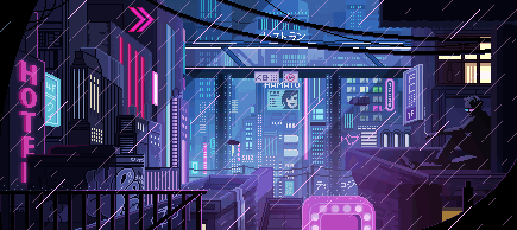

# Отдел цифрового развития ССФ СГН

Добро пожаловать! Мы создаём технологичную среду для студенческого совета.

## Наши направления
|  **Веб** |  **Аналитика** |  **Автоматизация** |
|:---:|:---:|:---:|
| Сайт студсовета, API, фронтенд, деплой | Данные, статистика, отчёты, дашборды | Скрипты, парсеры, интеграции |

## Основные репозитории
- [Handbook](https://github.com/Digital-SGN/Handbook) — справочник отдела, правила и обучающие материалы.
- [StudentCouncilPlatform](https://github.com/Demonrux/StudentCouncilPlatform) — репозиторий платформы студенческого совета.

## Контакты
- Telegram: [@Skebob_gg](https://t.me/@Skebob_gg)
- Сайт: [studsovetsgn.ru](https://studsovetsgn.ru)
