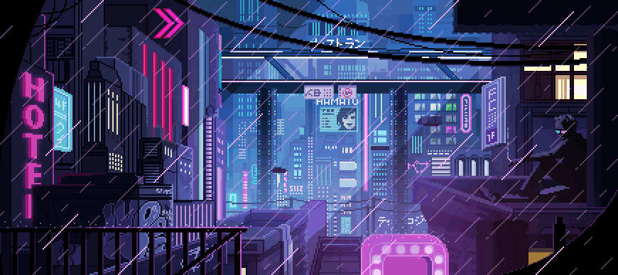

# Отдел цифрового развития ССФ СГН

Добро пожаловать! Мы создаём технологичную среду для студенческого совета.

## Наши направления
|  **Веб** |  **Аналитика** |  **Автоматизация** |
|:---:|:---:|:---:|
| Сайт студсовета, API, фронтенд, деплой | Данные, статистика, отчёты, дашборды | Скрипты, парсеры, интеграции |

## Основные репозитории
- [Handbook](https://github.com/Digital-SGN/Handbook) — справочник отдела, правила и обучающие материалы.
- [StudentCouncilPlatform](https://github.com/Digital-SGN/StudentCouncilPlatform) — репозиторий платформы студенческого совета.

## Контакты

  
  

---

  Отдел цифрового развития ССФ СГН · 2026

